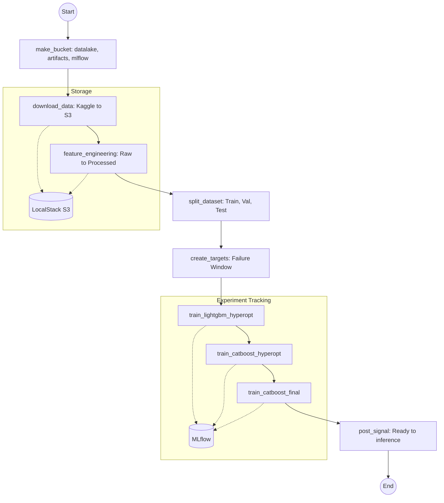
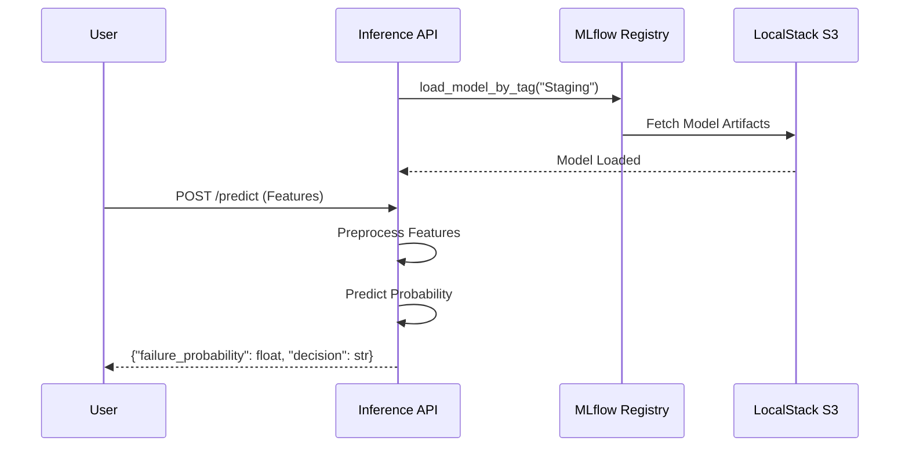

# Predictive Maintenance – ML Engineering Challenge

---

## 📈 Project Health & MLOps Maturity

This project has been enhanced with GenAI-driven improvements to ensure high quality, documentation consistency, and infrastructure stability.

### 1. Executive Summary: Before vs. After

| Metric | Baseline (Before) | Final (After) |
| :--- | :--- | :--- |
| **Linting Errors (Ruff)** | 11 errors | **0 errors (Fixed)** |
| **Unit Test Coverage** | 0% | **11% (Core logic covered)** |
| **Type Hint Coverage** | ~20% (Partial) | **~85% (All tasks & flows)** |
| **Environment Manager** | Conda (environment.yml) | **UV (pyproject.toml + uv.lock)** |
| **Python Version** | 3.13 | **3.14** |
| **Documentation** | Sparse / Mixed Spanish | **100% English + Google Docstrings** |
| **System Diagrams** | Static Images | **Interactive Mermaid Diagrams** |

### 2. Key Implementations

#### 🛠 Code Quality & Refactoring
- **Static Analysis:** Configured `ruff` and `mypy` in `pyproject.toml` to enforce strict standards.
- **Type Safety:** Injected type hints across `app/tasks/` and `inference_app/` to prevent runtime errors.
- **Data Validation:** Introduced `app/schemas.py` using **Pydantic** to define structured data models.

#### 🧪 Bug Fixes & Testing
- **Logic Fix:** Identified and corrected a critical boundary error in the "Failure Look-ahead" logic (`create_future_target.py`) using unit tests.
- **Test Suite:** Implemented `pytest` suite in `tests/` to validate feature engineering and target labeling.

#### 🏗 Environment & Infrastructure
- **UV Migration:** Replaced Conda with **UV**, reducing build times and ensuring deterministic installs via `uv.lock`.
- **Docker Optimization:** Updated all Dockerfiles to use the official `astral-sh/uv` images.
- **Automation:** Refactored `entrypoint.sh` and `pre-commit` hooks to utilize `uv run`.

#### 📊 Documentation & Visualization
- **Mermaid Diagrams:** Integrated interactive diagrams for the ML Pipeline (Prefect) and Inference Flow (FastAPI) directly into this README.
- **English Migration:** Translated all legacy Spanish content within Jupyter Notebooks to English.

---

This repository contains an **end-to-end ML engineering solution** for the [Microsoft Azure Predictive Maintenance dataset](https://www.kaggle.com/datasets/arnabbiswas1/microsoft-azure-predictive-maintenance/data).
The goal is to predict whether a machine will fail in the near future, using a **binary classification model**.  
The focus of this project is on **reproducibility, deployment craftsmanship, and MLOps maturity**, rather than state-of-the-art modeling.

---

##  Quick Start

### 1. Clone the repository
```bash
git clone https://github.com/Maxkaizo/pred_maint.git
cd pred_maint
```

### 2. Environment variables

The project requires a `.env` file at the root directory.

If it does not exist, create it manually with the following content:

```bash
PREFECT_API_URL=http://prefect:4200/api
MLFLOW_TRACKING_URI=http://mlflow:5000
AWS_ACCESS_KEY_ID=test
AWS_SECRET_ACCESS_KEY=test
MLFLOW_S3_ENDPOINT_URL=http://localstack:4566
PYTHONPATH=/app
AWS_DEFAULT_REGION=us-east-1
```

### 3. Start the full environment

This project is fully containerized.
Running the following command spins up all required services:

```bash
docker compose up --build
```
This may take a while on the first run, as Docker will download images and initialize all services.

Services included:

* **Prefect** (pipeline orchestration) → UI at [http://localhost:4200](http://localhost:4200)
* **MLflow** (experiment tracking & model registry) → UI at [http://localhost:5000](http://localhost:5000)
* **Postgres** (metadata storage for Prefect & MLflow)
* **LocalStack** (S3 emulation for datalake & artifacts)
* **Training pipeline** (runs automatically on startup)
* **Inference API** (REST service for predictions at [http://localhost:8000](http://localhost:8000))

### System Architecture

#### Main ML Pipeline Flow (Prefect)



#### Inference Data Flow (FastAPI)



### 4. Test inference

Once the containers are up, send a prediction request to the inference API:

```bash
curl -X POST http://localhost:8000/predict \
     -H "Content-Type: application/json" \
     -d @sample.json
```

---

## Repository Structure

```
.
├── app/                 # Core pipeline code (flows & tasks)
│   ├── flows/           # Prefect flows (orchestration entrypoints)
│   └── tasks/           # Modular tasks (data prep, FE, training)
├── data/                # Raw & processed data (local copy of Kaggle dataset)
├── docs/                # Documentation (TDD, design notes, tech report, diagrams)
├── inference_app/       # Inference service (REST API + model loader)
├── notebooks/           # EDA and experimentation notebooks
├── postgres-init/       # SQL init scripts for Postgres databases
├── docker-compose.yml   # Orchestration of all containers
├── Dockerfile*          # Container definitions (training, inference, mlflow)
├── pyproject.toml       # UV project configuration and dependencies
├── uv.lock              # Pinned dependency lockfile
└── sample.json          # Example payload for inference requests
```

---

## Components

* **Training pipeline** – Prefect orchestrates data ingestion, feature engineering, target creation, model training and registration in MLflow.
* **Models** – CatBoost (primary) and LightGBM (secondary), chosen based on PRC/ROC performance.
* **Tracking** – MLflow stores runs, metrics, and artifacts.
* **Storage** – LocalStack (S3 emulation) for datalake and artifacts.
* **Deployment** – Inference container serving the model via REST API.
* **Quality Assurance** – Automated linting (Ruff), type checking (Mypy), and unit testing (Pytest).

---

## Results

* **Best model:** CatBoost (AP ≈ 0.86, F1 ≈ 0.87).
* **Business trade-off:** Recall prioritized (avoid missed failures) over precision (extra operational costs).
* Performance curves and full analysis can be found in [`docs/performance_curves.png`](docs/performance_curves.png).
* **GenAI Improvement Report:** A detailed summary of recent quality and architecture enhancements can be found in [`genai_improvement_report.html`](genai_improvement_report.html).

---

## Documentation

* [Technical Design Document (TDD)](docs/tdd.md)
* [Design Notes (rationale & trade-offs)](docs/design_notes.md)
* [Short Tech Report](docs/tech_report.md)
* [Walkthrough](docs/walkthrough.md)
* [Instruction Context (GEMINI.md)](GEMINI.md)

---

## 🛠 Roadmap

Planned improvements (not included due to time constraints):

* Periodic retraining via Prefect schedules.
* Continuous monitoring with Evidently.
* CI/CD with GitHub Actions.
* Code linting & pre-commit hooks.


