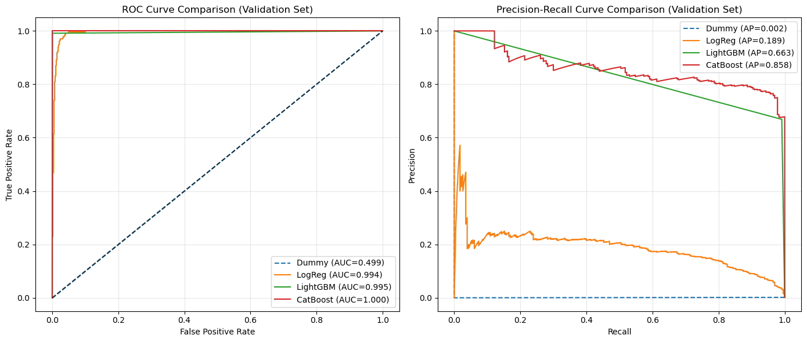

# Design Notes

These notes document **why** each decision was made.  
They complement the TDD (which focuses on **what** and **how**).

---

## 1. Business Context & Analogies
The dataset does not specify machine type.  
To justify design choices, we used **telecom field operations** as an analogy:  

- **Gap (4h):** equivalent to technician preparation + travel.  
- **Horizon (2h):** equivalent to typical repair/replacement time.  
- This analogy grounds the design in a realistic preventive maintenance context.  
- Important: we are **not** claiming the dataset is telecom-related.  

---

## 2. Pipeline Strategy
- **Phase 1 (delivered):** Single-run pipeline with reproducibility and deployment capability.  
- **Roadmap:** periodic retraining, CI/CD workflows, monitoring.  

---

## 3. Modeling Choices
- **Binary framing:**  
  - Initial idea was multiclass (which component fails).  
  - EDA + business review → reframed as **binary classification (failure vs. no failure)**, anticipating any future failure in the gap + horizon window.  
  - This better aligns with preventive maintenance goals (knowing *if* something will fail is more actionable than *which component*).  

- **Why CatBoost / LightGBM?**  
  - Both showed strong discriminative power on an imbalanced dataset.  
  - Decision supported by **ROC and Precision–Recall curves** (see EDA notebooks).
  - Logistic Regression was kept only as a weak baseline.  

- **Why not neural networks (TensorFlow)?**  
  - Tabular data favors boosting models (faster, more interpretable).  
  - Mentioned as possible roadmap item, but not used here.  

---

## 4. Metrics — Why these and not others
- **F1 score (primary):** chosen to balance precision and recall under imbalance.  
- **Precision / Recall (secondary):** explicit business interpretation:  
  - FP = operational cost (unnecessary technician visits).  
  - FN = downtime risk (missed failures).  
- **ROC AUC / Average Precision (reference):** used in EDA for model comparison.  
- **Macro F1 (discarded):** initially considered for multiclass; not used in final binary framing.  

---

## 5. Monitoring & Reliability
- **Not implemented** in this version due to time constraints.  
- **Roadmap:** Evidently drift reports + Prefect integration for periodic monitoring.  

---

## 6. Reproducibility
- **Docker Compose:** one-command setup (`docker compose up`) spins up the full environment:
  - MLflow, Prefect, Postgres, LocalStack, training pipeline, inference API.  
- **Prefect:** orchestration of data ingestion, preprocessing, training.  
- **MLflow:** experiment tracking, artifact storage, registry for serving.  
- **Seeds:** fixed for reproducibility.  
- **Deferred best practices:** linting (black), pre-commit hooks, CI checks → planned for roadmap.  

---

## 7. Feature Engineering Decisions
- **Rolling features:** computed telemetry-based rolling statistics before merging with other datasets.  
- **Reactive maintenance:** filtered out to avoid leakage (overlap with failures).  
- **Encoding:**  
  - Applied OneHotEncoding to `model` for comparability across algorithms.  
  - Even though CatBoost can natively handle categories, OHE ensures consistency.  
- **Scaling:** not applied (tree-based models are scale-invariant, magnitudes of features are comparable).  

---

## 8. Model Selection Decision
- Models evaluated: Dummy, Logistic Regression, LightGBM, CatBoost.  
- **CatBoost:** highest AP (~0.86), best PR curve, chosen as main production candidate.  
- **LightGBM:** AP ~0.66, selected as a strong alternative with lower computational cost.  
- **Logistic Regression:** poor AP (~0.18), retained only as baseline.  
- **Decision:** proceed with CatBoost (primary) and LightGBM (secondary).  

---

## 9. MLflow Version
- Chose **MLflow v2.x** for stability and maturity.  
- v3 considered too recent; migration left as roadmap.  

---

## 10. Deployment Decisions
- **Inference container** loads model directly from MLflow Registry by stage (Staging → Production).  
- Provides strong governance and traceability.  
- Roadmap: hybrid strategy where promoted models are also synced to S3 for resilience against registry downtime.  

---

## 11. Business Impact
- **Precision (~80%):** some extra technician visits (operational cost).  
- **Recall (~87%):** most failures anticipated (risk reduction).  
- Trade-off is acceptable: recall prioritized over precision, since avoiding unplanned downtime is more valuable than reducing operational costs.  
