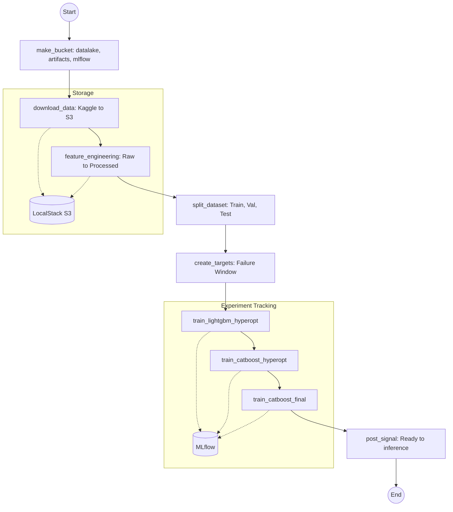
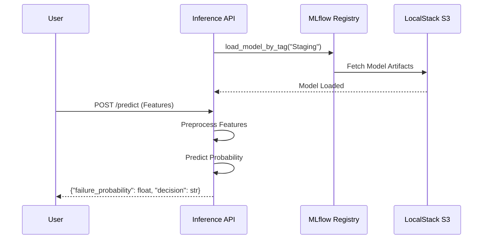

# System Diagrams

## Main ML Pipeline Flow (Prefect)

```mermaid
graph TD
    Start((Start)) --> Buckets[make_bucket: datalake, artifacts, mlflow]
    Buckets --> Download[download_data: Kaggle to S3]
    Download --> FE[feature_engineering: Raw to Processed]
    FE --> Split[split_dataset: Train, Val, Test]
    Split --> Target[create_targets: Failure Window]
    Target --> LGBM[train_lightgbm_hyperopt]
    LGBM --> CB_Hyper[train_catboost_hyperopt]
    CB_Hyper --> CB_Final[train_catboost_final]
    CB_Final --> Signal[post_signal: Ready to inference]
    Signal --> End((End))

    subgraph "Experiment Tracking"
        LGBM -.-> MLflow[(MLflow)]
        CB_Hyper -.-> MLflow
        CB_Final -.-> MLflow
    end

    subgraph "Storage"
        Download -.-> S3[(LocalStack S3)]
        FE -.-> S3
    end
```

## Inference Data Flow (FastAPI)

```mermaid
sequenceDiagram
    participant User
    participant API as Inference API
    participant MLflow as MLflow Registry
    participant S3 as LocalStack S3

    API->>MLflow: load_model_by_tag("Staging")
    MLflow->>S3: Fetch Model Artifacts
    S3-->>API: Model Loaded
    
    User->>API: POST /predict (Features)
    API->>API: Preprocess Features
    API->>API: Predict Probability
    API-->>User: {"failure_probability": float, "decision": str}
```
