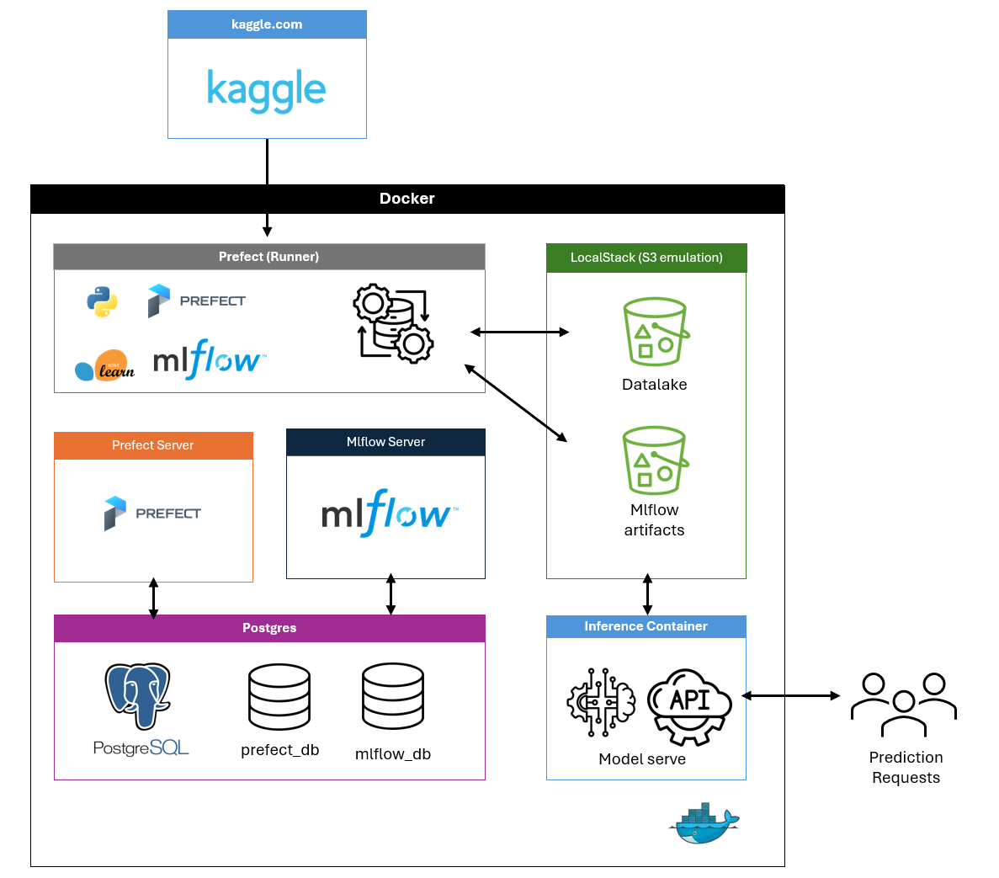

# Technical Design Document (TDD)

## 1. Problem Definition
The project delivers a **binary classification solution** that predicts whether a machine will fail in the near future.  
The objective is not to build the most complex model, but to provide a **production-grade ML pipeline** that demonstrates reproducibility, maintainability, and deployment craftsmanship.

---

## 2. Data Source
- **Dataset:** [Microsoft Azure Predictive Maintenance (Kaggle)](https://www.kaggle.com/datasets/arnabbiswas1/microsoft-azure-predictive-maintenance/data)  
- **Files used:** telemetry, errors, maintenance, failures, machines.  
- **Target Engineering:** labels are derived with a **gap (4h)** and **horizon (2h)** to anticipate failures.

---

## 3. Scope
- **Phase 1 (deliverables):**
  - End-to-end training pipeline (data ingestion → preprocessing → feature engineering → target labeling → training → evaluation → packaging).
  - MLflow experiment tracking and artifact storage.
  - Dockerized inference container exposing a REST API.
- **Phase 2 (roadmap):**
  - Scheduled retraining via Prefect.
  - Continuous monitoring with Evidently.
  - Multi-environment deployment (beyond LocalStack emulation).

---

## 4. Modeling Approach
- **Baselines:**
  - Dummy classifier (stratified).
  - Logistic Regression.
- **Main models:**
  - LightGBM (`binary objective`).
  - CatBoost (`Logloss`, with categorical support).
- **Selection criterion:** best **F1 score** with balanced recall, to minimize unexpected downtime.

---

## 5. Evaluation
- **Primary metric:** F1 score (balance between precision and recall).  
- **Secondary metrics:** Precision, Recall, ROC-AUC, confusion matrix.  
- **Business trade-offs:**  
  - False Positive → unnecessary maintenance (cost).  
  - False Negative → missed failure, unplanned downtime (risk).

---

## 6. System Architecture
- **Orchestration:** Prefect (flow runner, scheduling).  
- **Experiment tracking:** MLflow (server + registry + artifact storage).  
- **Storage:** LocalStack (S3 emulation for datalake + MLflow artifacts).  
- **Databases:** PostgreSQL for Prefect and MLflow metadata.  
- **Model serving:** Dockerized inference container exposing REST API.  
- **Reproducibility:** Python 3.11, `requirements.txt`, `Makefile`, containerized environment.  

---

## 7. Reproducibility & Engineering Practices
- **Automation:** end-to-end orchestration is covered by **Prefect flows** and **Docker Compose definitions**.  
  - Cloning the repository and running `docker compose up` spins up the full environment (databases, MLflow, Prefect, LocalStack, training pipeline, and inference API).  
  - The user only needs to wait until the process finishes and can then validate predictions directly.  
- **Repo structure:** modular Python scripts, organized by pipeline stage (ingestion, preprocessing, training, serving).  
- **Versioning:** Git for source code, MLflow for experiments, parameters, and artifacts.  
- **Deferred best practices (roadmap):**  
  - Code linting and formatting with **black**.  
  - Pre-commit hooks and GitHub Actions for CI/CD checks.  
  - Continuous monitoring integration (Evidently + Prefect).

---

## 8. Deliverables
- **GitHub repository** with all source code, docs, and infra definitions.
- **README** with onboarding instructions.
- **TDD (this document).**
- **Training pipeline** (Prefect + MLflow integration), main pipeline available at app/flows/main_pipeline
- **Deployment demo** (inference API container).
- **Short tech report** summarizing results, lessons, and next steps.
