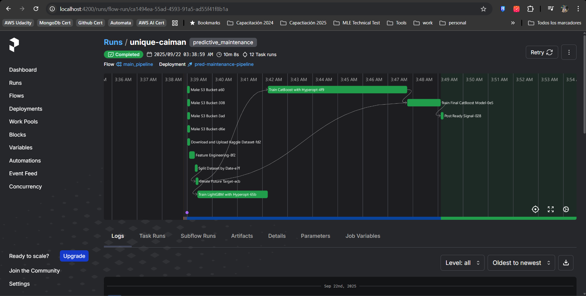
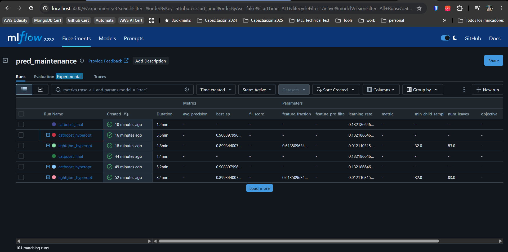
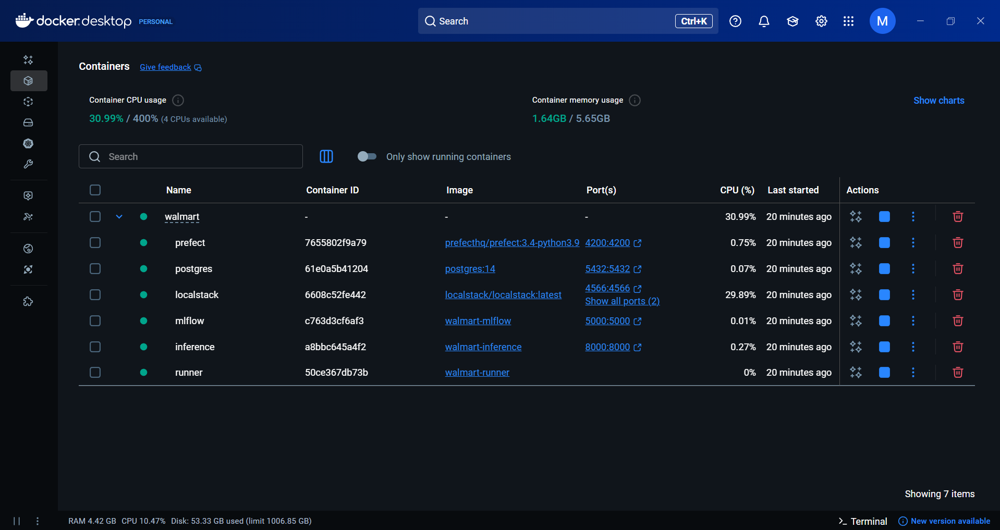
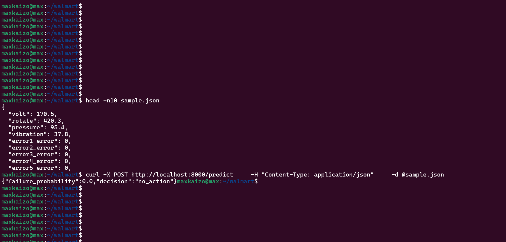

# Walkthrough – End-to-End Execution

This walkthrough demonstrates the correct functioning of the **Predictive Maintenance ML pipeline**, from orchestration to inference.  
All screenshots are taken from the running system.

---

## 1. Pipeline Execution with Prefect
The **main Prefect flow** runs end-to-end, covering:
- Dataset download from Kaggle
- Feature engineering
- Target creation
- Training with LightGBM and CatBoost (Hyperopt optimization)
- Final CatBoost training
- Signal posting once the model is ready

All tasks completed successfully.  



---

## 2. Experiment Tracking in MLflow
Each training run is tracked in **MLflow**, including:
- Parameters (hyperparameters from Hyperopt)
- Metrics (F1 score, Average Precision, etc.)
- Artifacts (models)

Here we can see multiple runs, with **CatBoost Hyperopt** achieving the best average precision.  



---

## 3. Dockerized Environment
All services run under **Docker Compose**:
- `prefect` – Orchestration
- `mlflow` – Tracking server
- `postgres` – Metadata storage
- `localstack` – S3 emulation
- `runner` – Executes Prefect flows
- `inference` – Model serving API

All containers are healthy.  



---

## 4. Inference API Demo
Finally, the trained model is served via a **REST API**.  

Using `sample.json` as input:
```bash
curl -X POST http://localhost:8000/predict \
     -H "Content-Type: application/json" \
     -d @sample.json
````

Response:

```json
{
  "failure_probability": 0.0,
  "decision": "no_action"
}
```

✅ The inference container successfully loads the latest CatBoost model from the MLflow Registry and serves predictions.



---

## ✅ Conclusion

This walkthrough demonstrates:

* **Automated pipeline orchestration** with Prefect
* **Experiment tracking** with MLflow
* **Reproducible infrastructure** via Docker Compose
* **Working inference service** exposing predictions through REST

The system is fully reproducible with a single command:

```bash
docker compose up --build
```
